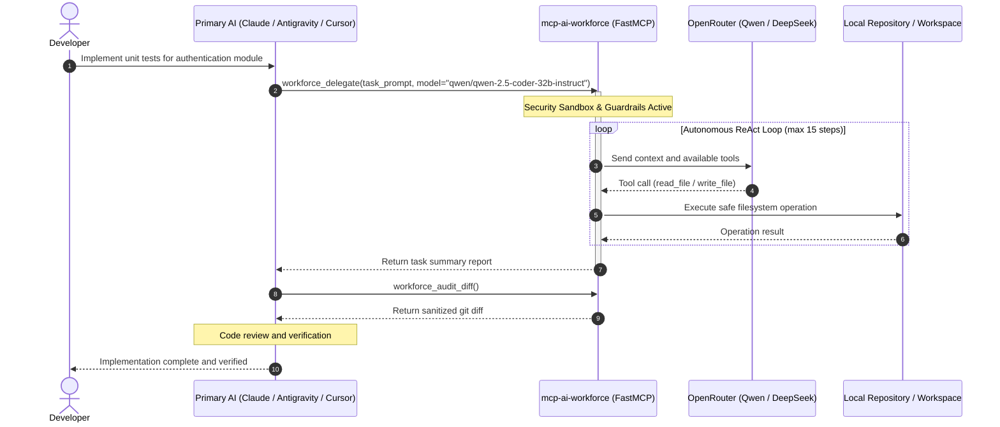

# MCP AI Workforce

### Autonomous Model Context Protocol Server for Cost-Effective AI Coding Delegation

[](https://github.com/DevImperatore/mcp-ai-workforce/actions/workflows/ci.yml)
[](https://www.python.org/downloads/)
[](https://modelcontextprotocol.io/)
[](https://openrouter.ai/)
[](LICENSE)
[]()

Empower primary AI orchestrators to delegate token-heavy coding tasks to economical models via OpenRouter, reducing token expenditure by up to 95%.

[Key Features](#key-features) | [Architecture](#architecture) | [Quickstart](#quickstart) | [Client Integrations](#client-integrations) | [Tools Reference](#tools-reference) | [Security](#security--sandboxing)

---

## The Problem and The Solution

### The Problem
Frontier AI models (Claude 3.7 Sonnet, Claude Opus, Gemini 2.5 Pro, GPT-4o) cost anywhere from $3.00 to $50.00+ per million tokens. Using these elite models for tasks such as writing repetitive test suites, formatting JSON payloads, generating boilerplate, or fixing syntactic linter errors consumes valuable context windows and leads to high operational costs.

### The Solution
`mcp-ai-workforce` is an open-source Model Context Protocol (MCP) server that establishes a two-tier delegation architecture:

1. **The Orchestrator:** The primary AI client (Claude Desktop, Google Antigravity, or Cursor) manages high-level architecture, breaks down engineering goals, and audits changes.
2. **The Autonomous Worker:** The orchestrator invokes `workforce_delegate`. `mcp-ai-workforce` executes a sandboxed ReAct loop powered by cost-effective coding models (such as Qwen 2.5 Coder 32B or DeepSeek V4 via OpenRouter at approximately $0.20 to $0.50 per million tokens).
3. **The Audit:** When execution completes, the orchestrator inspects the unified Git diff (`workforce_audit_diff`), conducts automated or manual code reviews, and approves the changes.

---

## Key Features

- **Cost Optimization:** Offload routine code generation to economical models while reserving frontier reasoning models for architectural oversight.
- **Zero-Trust Security Sandbox:**
  - **Path Confinement:** Validates canonical paths against the configured root directory to prevent directory traversal (`../../`) and unauthorized filesystem access.
  - **Credential Shielding (CWE-522):** Prohibits the worker from accessing or modifying `.env*` files, server source code, and cryptographic private keys.
  - **RCE-Immune Git Auditing (CWE-78):** Enforces sanitized flags (`--no-ext-diff`) to prevent arbitrary command execution via `.git/config`.
- **Autonomous ReAct Worker Loop:** Provides controlled filesystem operations (`read_file`, `write_file`, `list_dir`) with built-in infinite-loop detection and configurable step and timeout budgets.
- **Universal Client Support:** Compatible with Claude Desktop, Cursor IDE, Google Antigravity, Windsurf, and any standard MCP client across macOS, Linux, and Windows.
- **Automated Test Coverage:** Verified with 32 unit and integration tests executing across Python 3.10, 3.11, and 3.12 in continuous integration.

---

## Architecture



---

## Quickstart

### Prerequisites
- Python 3.10 or higher.
- Git installed and available on system PATH.
- An [OpenRouter](https://openrouter.ai/) API key.

### 1. Clone and Set Up Environment

```bash
# Clone the repository
git clone https://github.com/DevImperatore/mcp-ai-workforce.git
cd mcp-ai-workforce

# Create and activate a virtual environment
# On macOS / Linux:
python3 -m venv .venv
source .venv/bin/activate

# On Windows:
python -m venv .venv
.\.venv\Scripts\activate

# Install dependencies
pip install -r requirements.txt
```

### 2. Configure Environment Variables

Copy the template `.env.example` to `.env`:

```bash
cp .env.example .env
```

Edit `.env`:
```env
# OpenRouter API Key
OPENROUTER_API_KEY=sk-or-v1-xxxxxxxxxxxxxxxxxxxxxxxxxxxxxxxx

# Default model for worker tasks
DEFAULT_MODEL=qwen/qwen-2.5-coder-32b-instruct

# Canonical workspace path (defaults to current working directory if omitted)
WORKSPACE_ROOT=/path/to/your/project

# Execution limits
MAX_STEPS=15
TIMEOUT_SECONDS=300
```

---

## Client Integrations

### Claude Desktop
Add the following entry to `claude_desktop_config.json`:

- **macOS:** `~/Library/Application Support/Claude/claude_desktop_config.json`
- **Windows:** `%APPDATA%\Claude\claude_desktop_config.json`

```json
{
  "mcpServers": {
    "ai-workforce": {
      "command": "/path/to/mcp-ai-workforce/.venv/bin/python",
      "args": ["-m", "src.server"],
      "cwd": "/path/to/mcp-ai-workforce",
      "env": {
        "PYTHONUTF8": "1"
      }
    }
  }
}
```
*Note: On Windows, use `.venv\\Scripts\\python.exe` with properly escaped backslashes.*

---

### Cursor IDE
1. Open Cursor Settings (`Ctrl + Shift + J` or `Cmd + Shift + J`).
2. Navigate to **Features** > **MCP**.
3. Select **Add New MCP Server**:
   - **Name:** `ai-workforce`
   - **Type:** `command`
   - **Command:** `/path/to/mcp-ai-workforce/.venv/bin/python -m src.server`

---

### Google Antigravity
Add the server configuration to `~/.gemini/config/mcp_config.json`:

```json
{
  "mcpServers": {
    "ai-workforce": {
      "command": "/path/to/mcp-ai-workforce/.venv/bin/python",
      "args": ["-m", "src.server"],
      "cwd": "/path/to/mcp-ai-workforce",
      "env": {
        "PYTHONUTF8": "1"
      }
    }
  }
}
```

---

## Tools Reference

| Tool Name | Parameters | Description |
|---|---|---|
| `workforce_delegate` | `task_prompt` *(str, required)*<br>`target_files` *(list[str], optional)*<br>`model` *(str, optional)*<br>`timeout_seconds` *(int, default: 300)* | Dispatches an autonomous ReAct worker agent to inspect, modify, and create workspace files under strict security guardrails. |
| `workforce_models_status` | None | Reports API key connectivity, canonical workspace root path, execution limits, and recommended models. |
| `workforce_audit_diff` | `staged` *(bool, default: False)* | Executes a non-blocking git diff across the repository to inspect all changes generated by the worker. |

---

## Security and Sandboxing

The autonomous worker executes within a zero-trust sandbox:

1. **Path Jail (`validate_safe_path`):**
   - Canonicalizes and normalizes all target paths against `WORKSPACE_ROOT`.
   - Rejects directory traversal attempts (`../`, `..\\`, symlink redirection).
   - Blocks access to system directories (`/etc`, `C:\Windows`, etc.).
2. **Credential and Secrets Protection:**
   - Strictly blocks access to `.env*`, `.git/`, `.agents/mcp-ai-workforce/`, and private keys (`.pem`, `.key`, `id_rsa`).
3. **Execution Guardrails:**
   - **Infinite Loop Detection:** Halts execution if identical tool signatures are called 3 consecutive times.
   - **Resource Limits:** Enforces step bounds (`MAX_STEPS`) and hard timeouts (`TIMEOUT_SECONDS`) to prevent runaway API consumption.

---

## Example Prompts

Once configured, invoke tasks in natural language via your primary AI interface:

```text
"Please delegate to the workforce the task of writing comprehensive pytest 
unit tests for 'src/services/auth.py'. Once the worker finishes, call 
workforce_audit_diff to verify the changes."
```

```text
"Use workforce_delegate with model 'deepseek/deepseek-chat' to refactor 
all utility functions in 'utils/formatter.py' by adding full type annotations 
and Google-style docstrings."
```

---

## Running Tests

The test suite covers OpenRouter API mocks, path traversal defenses, loop traps, and FastMCP tool endpoints.

```bash
pytest -v
```

```text
============================= test session starts =============================
platform win32 / linux -- Python 3.10+ -- pytest-9.1.1
collected 32 items

tests/test_agent_loop.py::test_execute_tool_read_and_write PASSED        [  3%]
tests/test_agent_loop.py::test_execute_tool_guardrail_protection PASSED  [  6%]
tests/test_agent_loop.py::test_infinite_loop_detector PASSED             [  9%]
tests/test_agent_loop.py::test_agent_max_steps_limit PASSED              [ 12%]
tests/test_agent_loop.py::test_agent_normal_completion PASSED            [ 15%]
tests/test_fs_tools.py::test_worker_write_and_read_file PASSED           [ 18%]
...
tests/test_server.py::test_workforce_delegate_success PASSED             [ 81%]
tests/test_worker_loop.py::test_worker_loop_successful_termination PASSED [100%]

============================= 32 passed in 2.80s ==============================
```

---

## License

This project is licensed under the **MIT License**. See the [LICENSE](LICENSE) file for details.

---

**Developed by [DevImperatore](https://github.com/DevImperatore)**
