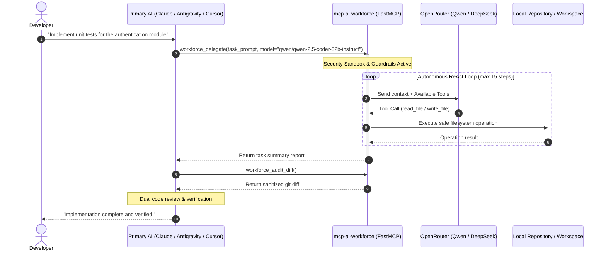

<div align="center">

# ⚡ MCP AI Workforce

### Autonomous Model Context Protocol Server for Cost-Effective AI Coding Delegation

[](https://github.com/DevImperatore/mcp-ai-workforce/actions/workflows/ci.yml)
[](https://www.python.org/downloads/)
[](https://modelcontextprotocol.io/)
[](https://openrouter.ai/)
[](LICENSE)
[]()

<p align="center">
  <b>Empower your primary AI orchestrator to delegate token-heavy coding tasks to economical models — reducing token expenditure by up to 95%.</b>
</p>

[Key Features](#-key-features) •
[Architecture](#-architecture) •
[Quickstart](#-quickstart) •
[Client Integrations](#-client-integrations) •
[Tools Reference](#-tools-reference) •
[Security](#-security--sandboxing)

</div>

---

## 💡 The Problem & The Solution

**The Dilemma:**  
Frontier AI models (Claude 3.7 Sonnet, Claude Opus, Gemini 2.5 Pro, GPT-4o) cost anywhere from **\$3.00 to \$50.00+ per million tokens**. Using these elite models to write 500 lines of repetitive test cases, format JSON payloads, generate standard boilerplate, or fix linter errors is an enormous waste of budget and context limits.

**The Solution:**  
**`mcp-ai-workforce`** is an open-source [Model Context Protocol (MCP)](https://modelcontextprotocol.io/) server that establishes a **"Brain vs. Hands"** delegation pipeline:
1. **The Brain (Your Orchestrator):** You talk to Claude Desktop, Google Antigravity, or Cursor as usual. It plans the architecture, oversees tasks, and audits results.
2. **The Hands (Autonomous Worker):** The orchestrator calls `workforce_delegate`. In the background, `mcp-ai-workforce` spawns a sandboxed ReAct loop powered by ultra-low-cost coding models (e.g. **Qwen 2.5 Coder 32B** or **DeepSeek V4** via OpenRouter at ~\$0.20-\$0.50/M tokens).
3. **The Audit:** Once the worker completes the task, your orchestrator inspects the unified Git diff (`workforce_audit_diff`), reviews the code, and confirms the changes.

---

## ✨ Key Features

- 💸 **Up to 95% Token Cost Reduction:** Run large refactors and boilerplates on sub-cent models while keeping your main orchestrator focused on architecture.
- 🛡️ **Zero-Trust Security Sandbox:**
  - **Path Confinement:** Strict directory validation prevents path traversal (`../../`) and access to system directories.
  - **Credential Shielding (CWE-522):** The worker is strictly forbidden from reading or modifying `.env*` files, server internals, or private keys.
  - **RCE-Immune Git Auditing (CWE-78):** Uses sanitized Git diff flags (`--no-ext-diff`) to prevent arbitrary command execution via `.git/config`.
- 🔄 **Autonomous ReAct Worker Loop:** Equips models with controlled filesystem primitives (`read_file`, `write_file`, `list_dir`) with built-in infinite-loop detection and configurable step/time budgets.
- 🔌 **Universal Client Support:** Compatible with **Claude Desktop**, **Cursor IDE**, **Google Antigravity**, **Windsurf**, and any MCP-compliant client across macOS, Linux, and Windows.
- 🧪 **100% Automated Test Coverage:** Thoroughly tested with 32 unit and integration tests running on automated CI matrices (Python 3.10, 3.11, 3.12).

---

## 🏛️ Architecture



---

## 🚀 Quickstart

### Prerequisites
- **Python 3.10+** installed on your system.
- **Git** installed and available on your system `PATH`.
- An **[OpenRouter](https://openrouter.ai/)** API key *(OpenRouter also offers free-tier models with 50 daily requests even at \$0 balance)*.

### 1. Clone & Set Up Environment

```bash
# Clone the repository
git clone https://github.com/DevImperatore/mcp-ai-workforce.git
cd mcp-ai-workforce

# Create and activate a virtual environment
# On macOS / Linux:
python3 -m venv .venv
source .venv/bin/activate

# On Windows:
python -m venv .venv
.\.venv\Scripts\activate

# Install dependencies
pip install -r requirements.txt
```

### 2. Configure Environment Variables

Copy the template `.env.example` to `.env`:

```bash
cp .env.example .env
```

Edit `.env`:
```env
# Your OpenRouter API Key
OPENROUTER_API_KEY=sk-or-v1-xxxxxxxxxxxxxxxxxxxxxxxxxxxxxxxx

# Default model for worker tasks
DEFAULT_MODEL=qwen/qwen-2.5-coder-32b-instruct

# Canonical workspace path (defaults to current working directory if omitted)
WORKSPACE_ROOT=/path/to/your/project

# Execution limits
MAX_STEPS=15
TIMEOUT_SECONDS=300
```

---

## 🔌 Client Integrations

Connect `mcp-ai-workforce` to your favorite AI assistant in seconds:

### Claude Desktop
Add this to your `claude_desktop_config.json`:

* **macOS:** `~/Library/Application Support/Claude/claude_desktop_config.json`
* **Windows:** `%APPDATA%\Claude\claude_desktop_config.json`

```json
{
  "mcpServers": {
    "ai-workforce": {
      "command": "/path/to/mcp-ai-workforce/.venv/bin/python",
      "args": ["-m", "src.server"],
      "cwd": "/path/to/mcp-ai-workforce",
      "env": {
        "PYTHONUTF8": "1"
      }
    }
  }
}
```
*(On Windows, replace `/path/to/.../bin/python` with `C:\\path\\to\\mcp-ai-workforce\\.venv\\Scripts\\python.exe`)*.

---

### Cursor IDE
1. Open **Cursor Settings** (`Ctrl + Shift + J` or `Cmd + Shift + J`).
2. Navigate to **Features** > **MCP**.
3. Click **Add New MCP Server**:
   - **Name:** `ai-workforce`
   - **Type:** `command`
   - **Command:** `/path/to/mcp-ai-workforce/.venv/bin/python -m src.server`

---

### Google Antigravity
Add the server configuration to `~/.gemini/config/mcp_config.json`:

```json
{
  "mcpServers": {
    "ai-workforce": {
      "command": "/path/to/mcp-ai-workforce/.venv/bin/python",
      "args": ["-m", "src.server"],
      "cwd": "/path/to/mcp-ai-workforce",
      "env": {
        "PYTHONUTF8": "1"
      }
    }
  }
}
```

---

## 🛠️ Tools Reference

| Tool Name | Parameters | Description |
|---|---|---|
| **`workforce_delegate`** | `task_prompt` *(str, required)*<br>`target_files` *(list[str], optional)*<br>`model` *(str, optional)*<br>`timeout_seconds` *(int, default: 300)* | Dispatches an autonomous ReAct worker agent to analyze, edit, and create files in your workspace under strict security guardrails. |
| **`workforce_models_status`** | *None* | Verifies API key connectivity, returns workspace root path, and lists recommended models with current configuration. |
| **`workforce_audit_diff`** | `staged` *(bool, default: False)* | Executes a secured, non-blocking `git diff` across the repository to inspect all changes generated by the worker. |

---

## 🛡️ Security & Sandboxing

The autonomous worker operates inside a hardened, zero-trust sandbox:

1. **Path Jail (`validate_safe_path`):**
   - Canonicalizes and normalizes all requested paths against `WORKSPACE_ROOT`.
   - Prevents directory traversal attacks (`../`, `..\\`, symlink escaping).
   - Blocks unauthorized root drives and OS system directories (`/etc`, `C:\Windows`, etc.).
2. **Credential & Secrets Shielding:**
   - Strictly blocks worker access to `.env`, `.env.*`, `.git/`, `.agents/mcp-ai-workforce/`, and private keys (`.pem`, `.key`, `id_rsa`).
3. **Execution Guardrails:**
   - **Infinite Loop Detection:** Detects and halts execution if the model invokes identical tool signatures 3 consecutive times.
   - **Step & Time Budgeting:** Hard caps execution to prevent runaway token charges (`MAX_STEPS` and `TIMEOUT_SECONDS`).

---

## 💡 Example Prompts

Once configured, simply instruct your primary AI in natural language:

```text
"Please delegate to the workforce the task of writing comprehensive pytest 
unit tests for 'src/services/auth.py'. Once the worker finishes, call 
workforce_audit_diff to verify the changes."
```

```text
"Use workforce_delegate with model 'deepseek/deepseek-chat' to refactor 
all utility functions in 'utils/formatter.py' by adding full type annotations 
and Google-style docstrings."
```

---

## 🧪 Running Tests

The test suite includes complete mocks for OpenRouter API calls, path traversal attacks, loop traps, and FastMCP tool execution.

```bash
# Activate your virtual environment and run:
pytest -v
```

```text
============================= test session starts =============================
platform win32 / linux -- Python 3.10+ -- pytest-9.1.1
collected 32 items

tests/test_agent_loop.py::test_execute_tool_read_and_write PASSED        [  3%]
tests/test_agent_loop.py::test_execute_tool_guardrail_protection PASSED  [  6%]
tests/test_agent_loop.py::test_infinite_loop_detector PASSED             [  9%]
tests/test_agent_loop.py::test_agent_max_steps_limit PASSED              [ 12%]
tests/test_agent_loop.py::test_agent_normal_completion PASSED            [ 15%]
tests/test_fs_tools.py::test_worker_write_and_read_file PASSED           [ 18%]
...
tests/test_server.py::test_workforce_delegate_success PASSED             [ 81%]
tests/test_worker_loop.py::test_worker_loop_successful_termination PASSED [100%]

============================= 32 passed in 2.80s ==============================
```

---

## 📄 License

This project is licensed under the **MIT License**. See the [LICENSE](LICENSE) file for details.

---

<div align="center">
  <b>Built with care by <a href="https://github.com/DevImperatore">DevImperatore</a></b><br>
  <sub>Contributions, issues, and feature requests are welcome! Feel free to check the <a href="https://github.com/DevImperatore/mcp-ai-workforce/issues">issues page</a>.</sub>
</div>
