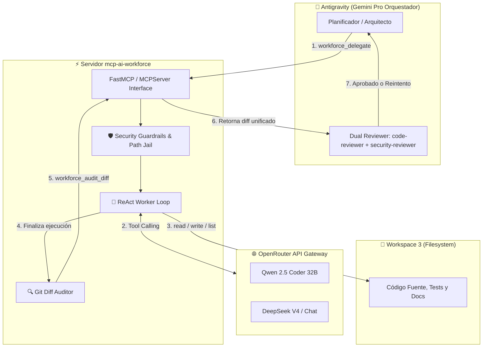

# MCP AI Workforce (`mcp-ai-workforce`)

[](https://www.python.org/downloads/)
[](https://modelcontextprotocol.io/)
[](LICENSE)
[]()

Servidor MCP de alto rendimiento para la orquestación y delegación asíncrona de tareas de software intensivas a modelos económicos (Qwen 2.5 Coder 32B, DeepSeek V4) mediante **OpenRouter**, operando bajo guardrails estrictos de seguridad y diseñado específicamente para el ecosistema **Google Antigravity & Workspace 3**.

---

## 🏛️ Filosofía Arquitectónica: Cerebro vs. Manos

En arquitecturas avanzadas de agentes de IA, ejecutar tareas repetitivas o voluminosas (generación de boilerplate, refactorizaciones sintácticas, creación de suites de tests, documentación masiva) en modelos frontera (como Gemini Pro o Claude Sonnet) satura la cuota de contexto y quema presupuestos innecesariamente.

**`mcp-ai-workforce`** implementa el patrón **Cerebro - Obrero**:
- **Cerebro (Antigravity / Gemini Pro):** Diseña la arquitectura, planifica tareas DAG, delega el trabajo pesado y realiza la auditoría final.
- **Obrero (Worker Loop / Qwen 2.5 Coder o DeepSeek V4 vía OpenRouter):** Ejecuta bucles ReAct iterativos con herramientas locales (`read_file`, `write_file`, `list_dir`) confinado a un sandbox estricto.
- **Auditoría Dual:** Al finalizar, el orquestador recupera el `git diff` mediante `workforce_audit_diff` y despacha a sus subagentes especializados (`code-reviewer` + `security-reviewer`) para verificar los cambios antes de consolidarlos.



---

## 📁 Estructura del Proyecto

```text
.agents/mcp-ai-workforce/
├── pyproject.toml              # Metadatos del paquete y configuración pytest
├── requirements.txt            # Dependencias reproducibles
├── .env.example                # Plantilla de variables de entorno
├── .gitignore                  # Exclusiones de Git (.env, .venv, caches)
├── LICENSE                     # Licencia MIT completa
├── README.md                   # Documentación oficial
├── src/
│   ├── __init__.py             # Inicializador de paquete
│   ├── config.py               # Configuración tipada e inmutable (Settings)
│   ├── guardrails.py           # Guardrails contra path traversal y comandos destructivos
│   ├── server.py               # Servidor FastMCP/MCPServer y registro de herramientas
│   └── worker/
│       ├── __init__.py         # Exportaciones de herramientas del obrero
│       ├── fs_tools.py         # Primitivas seguras: worker_read_file, worker_write_file, worker_list_dir
│       └── agent_loop.py       # Bucle ReAct con detección de loop infinito y max_steps
└── tests/
    ├── __init__.py             # Inicializador de suite de tests
    ├── test_guardrails.py      # Tests exhaustivos de path traversal y blacklist de comandos
    ├── test_worker_loop.py     # Mocks de OpenRouter, terminación, loop detector y max_steps
    ├── test_fs_tools.py        # Tests unitarios de primitivas de sistema de archivos
    ├── test_agent_loop.py      # Tests de dispatching y límites del bucle
    └── test_server.py          # Tests de invocación de workforce_models_status, audit_diff y delegate
```

---

## 🛡️ Guardrails y Mecanismos de Seguridad

El obrero delegado ejecuta código de manera autónoma pero controlada:

1. **Aislamiento de Rutas (`validate_safe_path`):**
   - Confinamiento estricto al directorio `WORKSPACE_ROOT`.
   - Resolución de enlaces simbólicos y normalización de mayúsculas/minúsculas para Windows (`os.path.normcase`).
   - Bloqueo categórico de escapes de ruta (`../../`, `..\\`), rutas absolutas del sistema operativo (`C:\Windows`, `C:\Windows\System32`), y unidades secundarias.

2. **Bloqueo de Comandos Destructivos (`validate_safe_command`):**
   - Detección regex insensible a mayúsculas/minúsculas.
   - Bloqueo preventivo de: `rm -rf`, `del /f`, `format c:`, `sudo`, `su`, `runas`, `rmdir /s /q`, `erase`, `dd`, `drop database`, `truncate table`, y fork bombs.
   - Permite comandos de desarrollo seguros: `pytest`, `git status`, `git log --format=oneline`, `python --version`, etc.

3. **Detector de Bucle Infinito (*Infinite Loop Trap*):**
   - El worker loop rastrea la firma `(tool_name, serialized_args)`.
   - Si el modelo invoca la misma herramienta con argumentos idénticos 3 veces consecutivas, el ciclo aborta inmediatamente con un error descriptivo.

4. **Límites de Pasos y Timeout:**
   - Parada forzada si alcanza `MAX_STEPS` (por defecto: 15 iteraciones).
   - Aborto por tiempo de espera si supera `TIMEOUT_SECONDS` (por defecto: 300 segundos).

---

## 🚀 Instalación y Configuración

### 1. Requisitos Previos
- Python 3.10 o superior (verificado con Python 3.12.10).
- Git instalado y configurado en el sistema.
- Clave de API de [OpenRouter](https://openrouter.ai/).

### 2. Creación del Entorno Virtual e Instalación
Desde PowerShell en Windows:

```powershell
cd "c:\Users\thoma\OneDrive\Escritorio\Workspace 3\.agents\mcp-ai-workforce"
python -m venv .venv
.\.venv\Scripts\pip install -r requirements.txt
```

### 3. Configuración del Archivo `.env`
Copia `.env.example` a `.env` y configura tus variables:

```powershell
Copy-Item .env.example .env
```

Contenido de `.env`:
```env
# Clave API de OpenRouter
OPENROUTER_API_KEY=sk-or-v1-xxxxxxxxxxxxxxxxxxxxxxxxxxxxxxxx

# Modelo predeterminado para el obrero
DEFAULT_MODEL=qwen/qwen-2.5-coder-32b-instruct

# Directorio raíz permitido para las operaciones
WORKSPACE_ROOT=C:\Users\thoma\OneDrive\Escritorio\Workspace 3

# Límites de ejecución
MAX_STEPS=15
TIMEOUT_SECONDS=300
```

---

## 🔌 Integración en Google Antigravity

Para registrar `mcp-ai-workforce` como servidor MCP permanente en Antigravity, edita el archivo de configuración global en `C:\Users\thoma\.gemini\config\mcp_config.json`:

```json
{
  "mcpServers": {
    "mcp-ai-workforce": {
      "command": "C:\\Users\\thoma\\OneDrive\\Escritorio\\Workspace 3\\.agents\\mcp-ai-workforce\\.venv\\Scripts\\python.exe",
      "args": [
        "src/server.py"
      ],
      "cwd": "C:\\Users\\thoma\\OneDrive\\Escritorio\\Workspace 3\\.agents\\mcp-ai-workforce",
      "env": {
        "PYTHONUTF8": "1"
      }
    }
  }
}
```

Al reiniciar o recargar las herramientas en Antigravity, tendrás disponibles de inmediato las siguientes herramientas:
- `mcp_mcp-ai-workforce_workforce_delegate`
- `mcp_mcp-ai-workforce_workforce_models_status`
- `mcp_mcp-ai-workforce_workforce_audit_diff`

---

## 🛠️ Referencia de Herramientas MCP

### 1. `workforce_delegate`
Delega una tarea de desarrollo de software al obrero ReAct.
- **Parámetros:**
  - `task_prompt` *(str, requerido)*: Descripción completa y precisa del objetivo técnico.
  - `target_files` *(list[str], opcional)*: Lista de rutas relativas de archivos involucrados.
  - `model` *(str, opcional)*: Identificador del modelo en OpenRouter (e.g. `qwen/qwen-2.5-coder-32b-instruct` o `deepseek/deepseek-chat`). Si se omite, usa `DEFAULT_MODEL`.
  - `timeout_seconds` *(int, opcional)*: Límite de tiempo en segundos (default: 300).
- **Retorno:** Informe final de conclusión o resumen emitido por el modelo.

### 2. `workforce_models_status`
Comprueba el estado de la configuración, el saldo/disponibilidad de la API key de OpenRouter y los modelos recomendados.
- **Retorno:** Objeto JSON con el estado de conexión (`ready` o `needs_configuration`), ruta de workspace, modelo por defecto y catálogo de modelos recomendados.

### 3. `workforce_audit_diff`
Inspecciona las modificaciones realizadas en el espacio de trabajo ejecutando `git diff`.
- **Parámetros:**
  - `staged` *(bool, opcional)*: Si es `True`, revisa cambios en stage (`git diff --staged`); si es `False`, cambios en working tree (`git diff`).
- **Retorno:** Salida unificada del diff o mensaje de estado limpio.

---

## 💡 Ejemplos de Prompts para Delegación

### Ejemplo 1: Generación Masiva de Pruebas Unitarias
> *"Por favor delega al worker `qwen/qwen-2.5-coder-32b-instruct` la tarea de crear la suite completa de tests para el módulo `scripts/job_applier.py`. Debe cubrir funciones auxiliares, validaciones de formato y manejo de errores. Cuando termine, ejecuta `workforce_audit_diff` y revisa los cambios con `code-reviewer`."*

### Ejemplo 2: Refactorización y Tipado Estricto (Type Annotations)
> *"Usa `workforce_delegate` con el modelo `deepseek/deepseek-chat` para añadir type hints completos de `typing` y docstrings estilo Google a todas las funciones en `src/utils/data_cleaner.py`. Archivos objetivo: `['src/utils/data_cleaner.py']`."*

### Ejemplo 3: Creación de Boilerplate y Migraciones
> *"Delega al worker la creación de un nuevo módulo `src/services/billing.py` con una clase `BillingService` que implemente métodos stub para cobro con Stripe y cálculo de impuestos. Limita el tiempo a 180 segundos."*

### Ejemplo 4: Workflow Dual Completo en Antigravity
1. **Delegación:** Antigravity invoca `workforce_delegate(...)`.
2. **Ejecución:** El obrero examina el entorno, crea o edita archivos y confirma la finalización.
3. **Auditoría:** Antigravity ejecuta `workforce_audit_diff()`.
4. **Verificación Dual:** Antigravity despacha en paralelo `code-reviewer` y `security-reviewer` sobre el parche.
5. **Aprobación:** Si ambos revisores aprueban, Antigravity consolida el commit en Git.

---

## 🧪 Ejecución de Pruebas Unitarias

La suite de pruebas cubre guardrails de ruta, bloqueo de comandos maliciosos, simulación de respuestas con mocks de OpenRouter, bucles infinitos, paradas por `max_steps`, y llamadas al servidor FastMCP.

Para ejecutar la suite completa:

```powershell
.\.venv\Scripts\pytest -v
```

Salida esperada:
```text
tests/test_agent_loop.py::test_execute_tool_read_and_write PASSED
tests/test_agent_loop.py::test_execute_tool_guardrail_protection PASSED
tests/test_agent_loop.py::test_infinite_loop_detector PASSED
tests/test_agent_loop.py::test_agent_max_steps_limit PASSED
tests/test_agent_loop.py::test_agent_normal_completion PASSED
tests/test_fs_tools.py::test_worker_write_and_read_file PASSED
tests/test_fs_tools.py::test_worker_read_nonexistent PASSED
tests/test_fs_tools.py::test_worker_write_traversal_blocked PASSED
tests/test_fs_tools.py::test_worker_list_dir PASSED
tests/test_guardrails.py::TestValidateSafePath::test_valid_paths_inside_workspace PASSED
tests/test_guardrails.py::TestValidateSafePath::test_path_traversal_with_dot_dot_slash PASSED
tests/test_guardrails.py::TestValidateSafePath::test_access_windows_system_directory_blocked PASSED
tests/test_guardrails.py::TestValidateSafePath::test_absolute_paths_outside_workspace_blocked PASSED
tests/test_guardrails.py::TestValidateSafeCommand::test_blocking_rm_rf PASSED
tests/test_guardrails.py::TestValidateSafeCommand::test_blocking_del_f PASSED
tests/test_guardrails.py::TestValidateSafeCommand::test_blocking_format_c PASSED
tests/test_guardrails.py::TestValidateSafeCommand::test_blocking_sudo PASSED
tests/test_guardrails.py::TestValidateSafeCommand::test_allowing_safe_commands_pytest_git_status PASSED
tests/test_server.py::TestServerTools::test_workforce_models_status_ready_state PASSED
tests/test_server.py::TestServerTools::test_workforce_models_status_needs_configuration PASSED
tests/test_server.py::TestServerTools::test_workforce_audit_diff_clean_workspace PASSED
tests/test_server.py::TestServerTools::test_workforce_audit_diff_with_modifications PASSED
tests/test_server.py::TestServerTools::test_workforce_audit_diff_git_error PASSED
tests/test_server.py::TestServerTools::test_workforce_audit_diff_missing_git_binary PASSED
tests/test_server.py::TestServerTools::test_workforce_delegate_success PASSED
tests/test_server.py::TestServerTools::test_workforce_delegate_handles_exception PASSED
tests/test_worker_loop.py::TestWorkerLoop::test_worker_loop_successful_termination_immediate PASSED
tests/test_worker_loop.py::TestWorkerLoop::test_worker_loop_successful_termination_with_tools PASSED
tests/test_worker_loop.py::TestWorkerLoop::test_worker_loop_infinite_loop_detection PASSED
tests/test_worker_loop.py::TestWorkerLoop::test_worker_loop_stops_at_max_steps PASSED
tests/test_worker_loop.py::TestWorkerLoop::test_worker_loop_missing_api_key_raises PASSED

============================= 31 passed in 3.13s ==============================
```

---

## 📄 Licencia

Este proyecto está bajo la Licencia **MIT**. Consulta el archivo [LICENSE](LICENSE) para más información.
